# GitOps Kubernetes Deployment on AWS EKS

A production-style GitOps setup that deploys a **microservices-based**, real-time multiplayer web application to **Amazon EKS**, using **ArgoCD** for continuous delivery, **Docker Hub** as the container registry, and **Amazon RDS (MySQL)** for persistent stats storage.

This repo documents the infrastructure, deployment pipeline, and operational workflows used to run the cluster end to end — from provisioning through rollout, monitoring, and rollback.

---

## Architecture Overview

- **Cloud provider:** AWS
- **Kubernetes:** Amazon EKS (Auto Mode), running Kubernetes v1.36
- **GitOps engine:** ArgoCD (v3.5.0), auto-sync enabled from a Git repository
- **Ingress:** ingress-nginx
- **Container registry:** Docker Hub
- **Database:** Amazon RDS for MySQL (8.4.9)
- **Compute:** EC2 bastion/admin host + EKS-managed worker nodes (`c7i-flex.large`)

The application is split into independently deployable microservices:

| Component | Purpose |
|---|---|
| `frontend` | Serves the web UI |
| `game-service` | Core game/session logic |
| `match-service` | Match orchestration |
| `player-service` | Player identity/session handling |
| `stats-service` | Aggregates win/loss/draw stats |
| MySQL (RDS) | Persistent storage for player stats |

Each service is independently containerized, versioned, and pushed to Docker Hub, then deployed to the cluster declaratively through ArgoCD.

### Why Microservices

Splitting the application into separate services (frontend, game, match, player, stats) rather than a single monolith means:

- Each service has its **own Docker image, version tag, and deployment lifecycle** — one service can be updated or rolled back without touching the others.
- Services **scale independently** — e.g. `game-service` can be scaled up under load without over-provisioning the `frontend` or `stats-service`.
- Failures are **isolated** — an issue in one microservice doesn't take down the whole application.
- It maps cleanly onto Kubernetes primitives: each microservice gets its own Deployment, ReplicaSet, and Service/ClusterIP, all visible as separate nodes in the ArgoCD resource tree below.

---

## GitOps Delivery with ArgoCD

ArgoCD continuously watches the Git repository and reconciles the live cluster state against the desired state defined in manifests. Auto-sync is enabled, so any merged change to the manifests is automatically rolled out.

**Applications dashboard:**

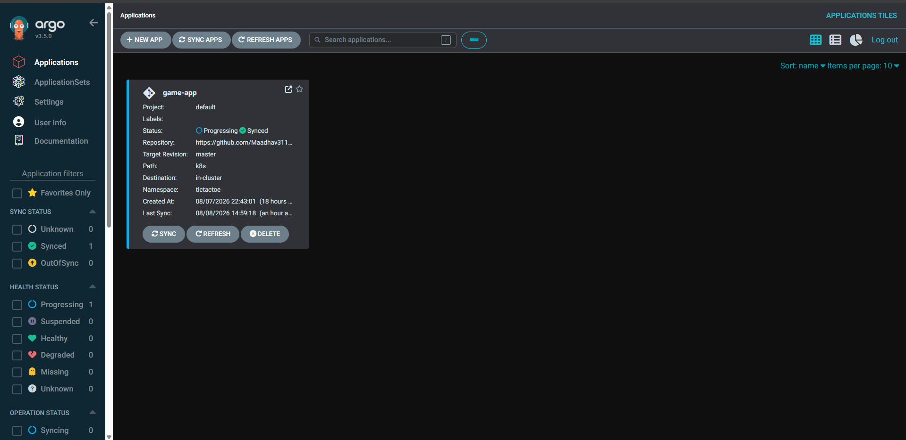

**Application resource tree** — shows the full dependency graph from Deployments → ReplicaSets → Pods, along with sync/health status and revision history per service:

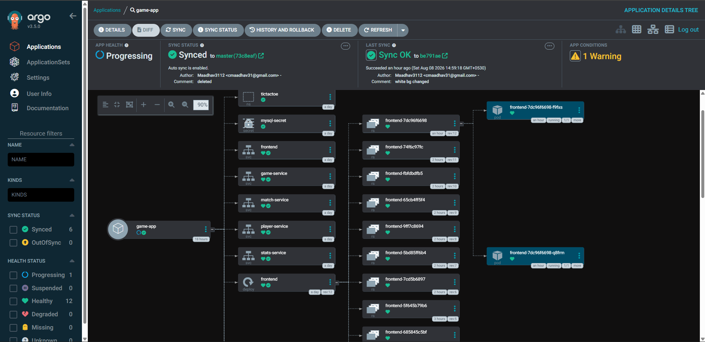

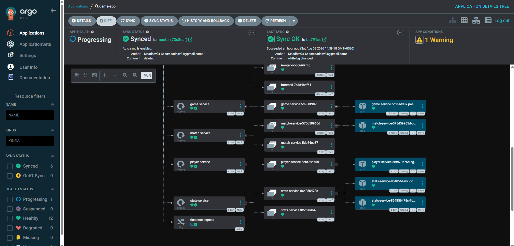

**Network view** — traces traffic flow from the ingress controller through each service to its backing pods:

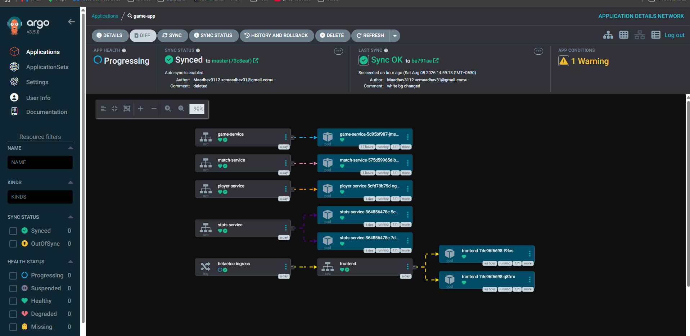

---

## Kubernetes Cluster (Amazon EKS)

The cluster runs in **EKS Auto Mode**, which offloads node provisioning and lifecycle management to AWS. It is organized into two managed node pools (`system` and `general-purpose`).

**Cluster summary:**

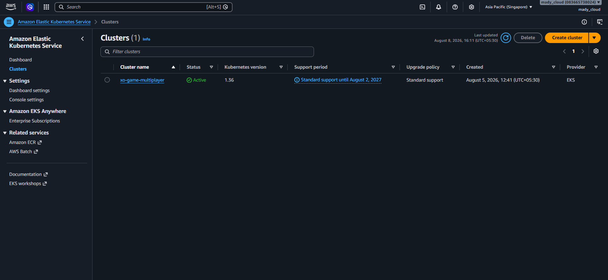

**Worker nodes:**

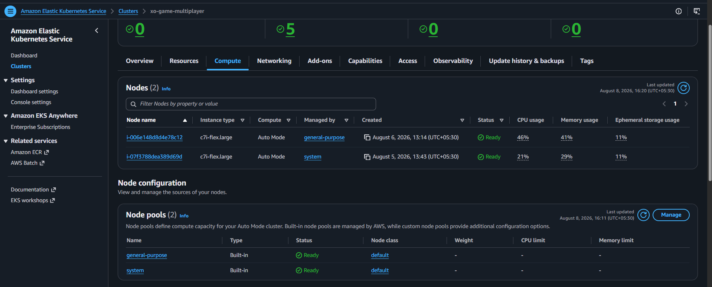

**Node capacity allocation** (CPU, memory, pods, ephemeral storage):

  

**Pods scheduled on a worker node:**

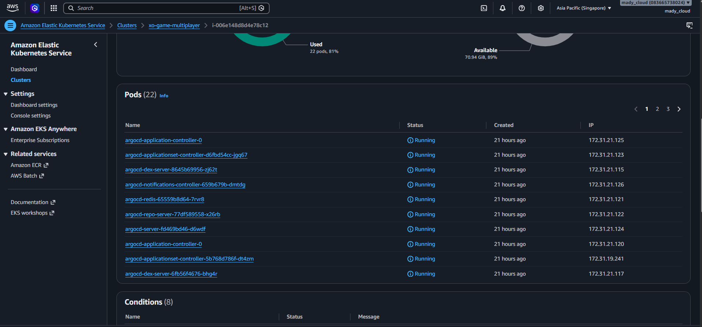

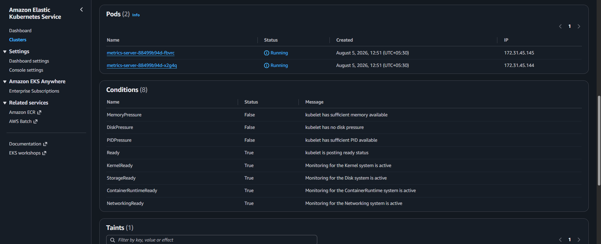

**Namespaces** — workloads are isolated by namespace (`argocd`, `ingress-nginx`, and the application namespace, alongside the default system namespaces):

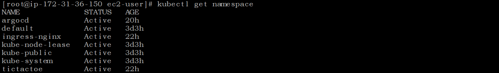

---

## Cluster Operations via kubectl

Day-to-day operations are performed from an EC2 admin/bastion host with `kubectl` access to the cluster.

**Inspecting pods and services across namespaces:**

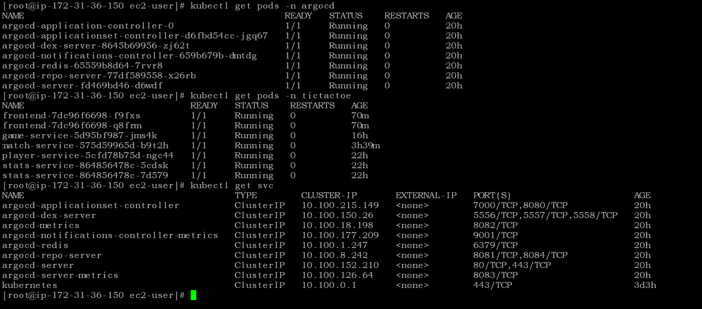

**Rolling restarts and rollout status** — deployments can be restarted and their rollout progress tracked in real time, enabling zero-downtime updates and rollback if a release misbehaves:

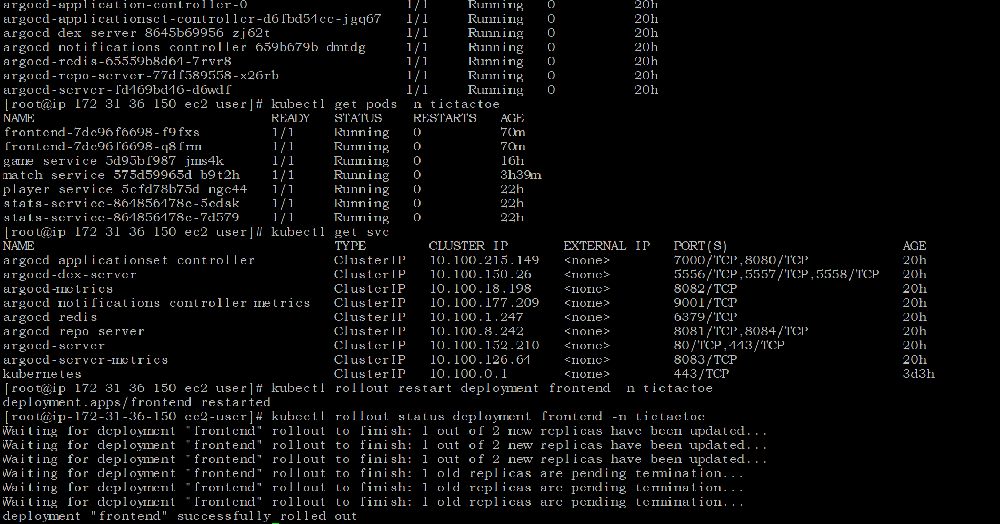

---

## Identity & Access Management (AWS IAM)

Access to the cluster and supporting AWS resources is controlled through dedicated IAM users with scoped permissions, separate from the account root user.

**IAM users provisioned for cluster administration and secret management:**

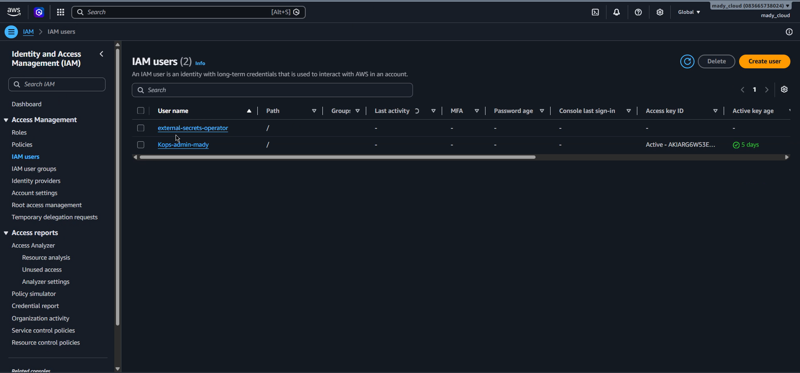

**Permissions attached to the cluster admin user:**

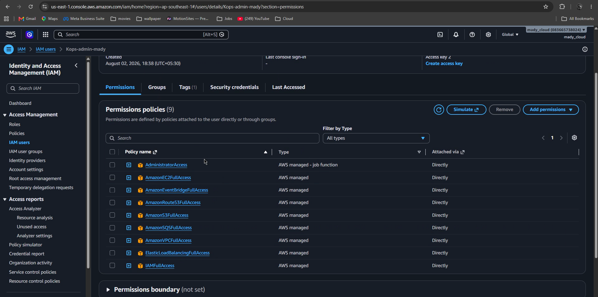

---

## Compute (EC2)

Alongside the managed EKS worker nodes, an EC2 instance serves as the administration/bastion host used to run `kubectl` and manage the cluster.

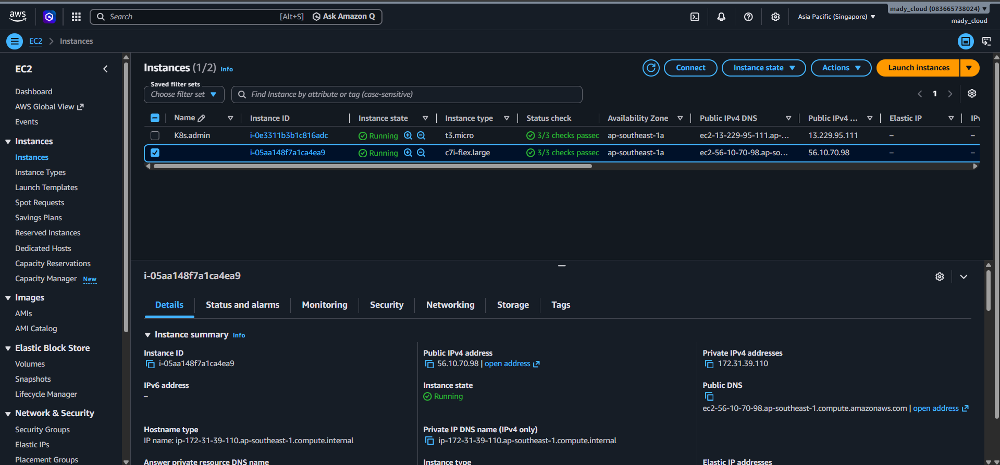

---

## Container Images (Docker Hub)

Each microservice is built into its own image and published to a private Docker Hub repository, tagged by version (`latest`, `v2`, `v2.1`, etc.) to support controlled rollouts and rollbacks.

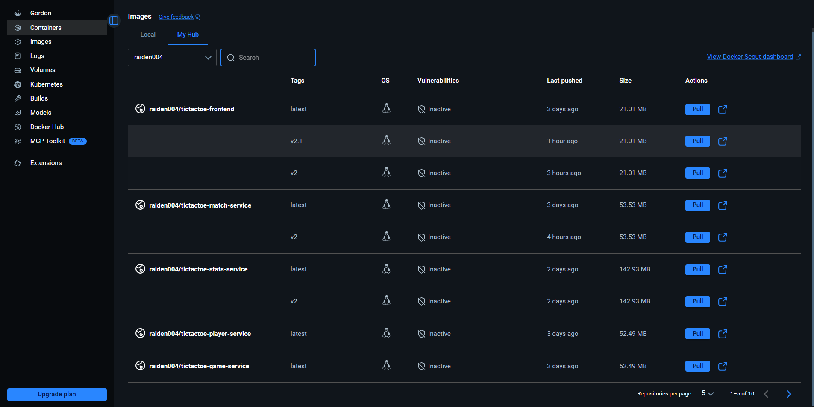

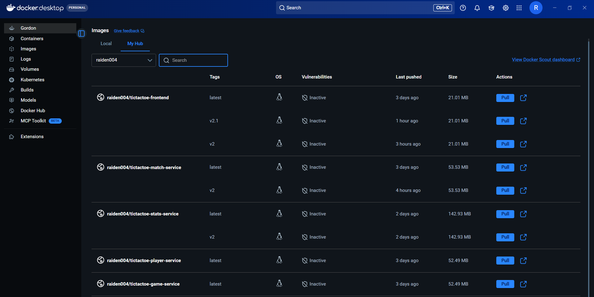

---

## Database Layer (Amazon RDS for MySQL)

Player statistics are persisted in a MySQL database hosted on Amazon RDS, decoupling stateful data from the stateless application pods.

**Connecting to the RDS instance:**

**Player stats table:**

---

## Application in Action

The end-to-end deployment serves a live, real-time web app with player matchmaking and a persistent leaderboard backed by the database layer described above.

**Lobby and leaderboard:**

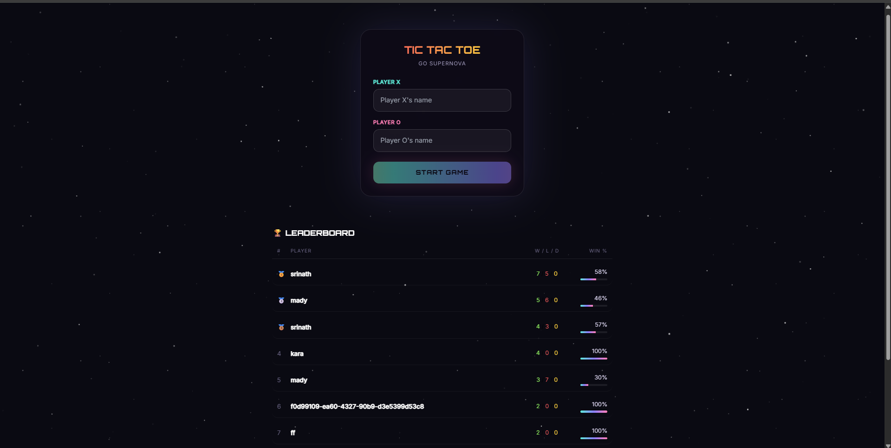

**Live session:**

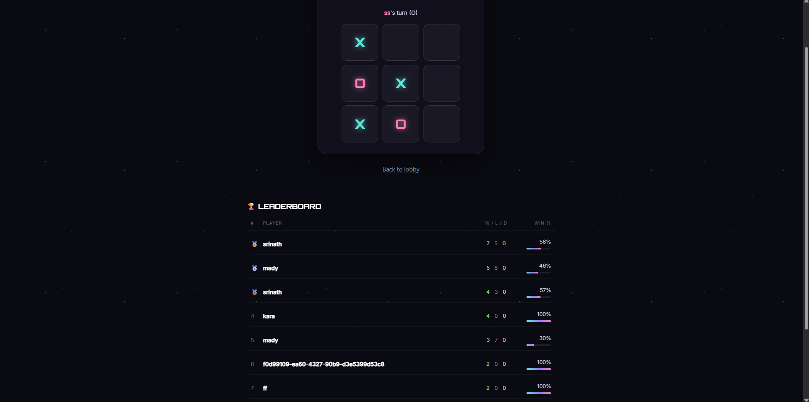

**Match result and updated leaderboard:**

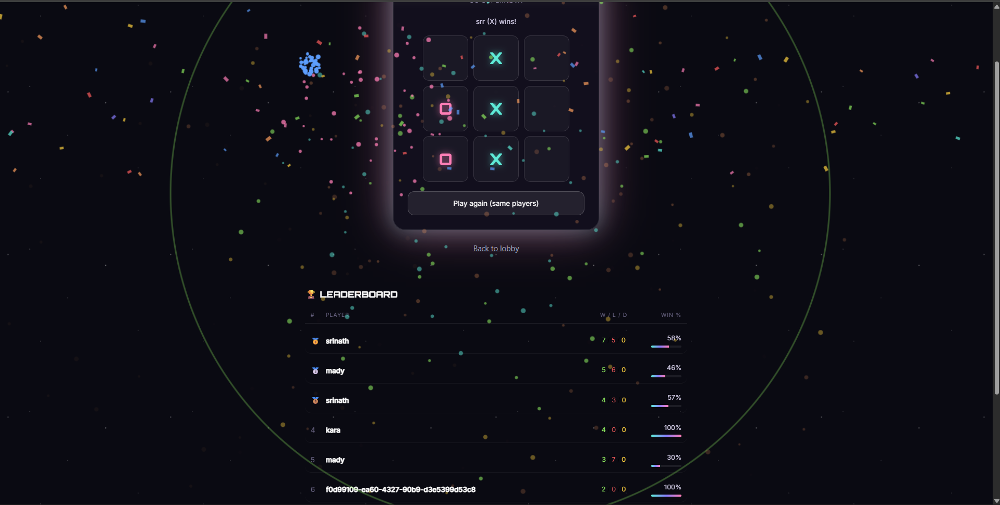

---

## Key Highlights

- **Declarative, Git-driven deployments** — ArgoCD keeps the cluster in sync with the Git repo automatically, giving a full audit trail of every change (author, commit, timestamp).
- **Zero-downtime rollouts and easy rollback** — rolling deployment restarts and ArgoCD's history/rollback feature allow safe recovery from bad releases.
- **Microservices architecture** — each service is independently built, versioned, containerized, and deployed.
- **Managed Kubernetes with EKS Auto Mode** — reduces operational overhead of node provisioning and scaling.
- **Least-privilege access** — dedicated IAM users/policies for cluster administration and secrets management instead of shared root credentials.
- **Externalized, durable data layer** — application state is persisted in RDS rather than in-cluster, keeping pods stateless and easy to scale or replace.

---

> Note: This README documents the deployed system based on cluster/dashboard screenshots. Add your Kubernetes manifests, ArgoCD `Application` definitions, and CI/CD pipeline config alongside this README as the source of truth for the GitOps workflow.
